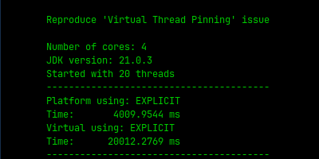
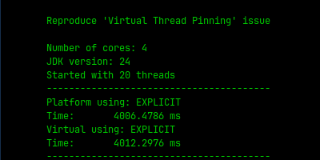

## Reproducing Virtual Threads Pinning issue
This experiment was inspired on the Dan Vegas's blog article:
[JDK 24's Major Improvement: Virtual Threads Without Pinning](https://www.danvega.dev/blog/jdk-24-virtual-threads-without-pinning)

#### Run the experiment with 20 threads
`java -jar target/vt-pinned-1.0-SNAPSHOT-jar-with-dependencies.jar -t 20 explicit`

> [!IMPORTANT]
> This require to switch the JDK 21 to JDK 24 by using `sdkman` ou `jenv`.

#### Output result
<figure>
  <figcaption>The total execution time were 20 seconds for virtual thread.</figcaption>
  
</figure>

<figure>
  <figcaption>In JDK 24 the pinning issue is solved.</figcaption>
  
</figcaption>